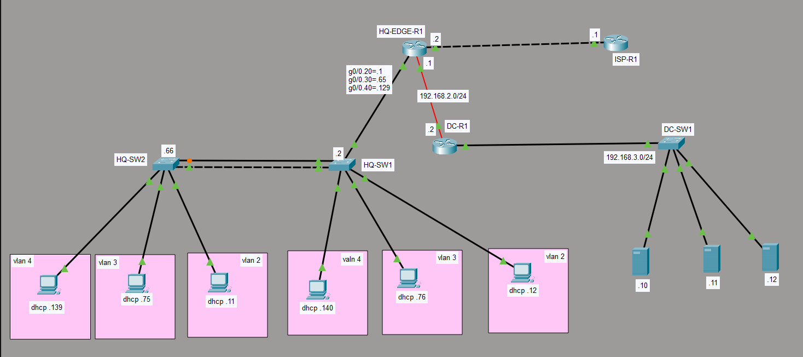

# Enterprise Multi-Site Network with VLANs, EIGRP, DHCP & NAT

> A two-site Cisco enterprise network (Headquarters + Data Center) built in Cisco Packet Tracer, featuring VLAN segmentation, inter-VLAN routing on a stick, EIGRP dynamic routing, DHCP services, NAT/PAT for Internet access, and static NAT for public-facing servers.

---

## Project Overview

This project demonstrates the design and implementation of a multi-site enterprise network using Cisco Packet Tracer.

The network is divided into two sites — a **Headquarters (HQ)** site and a **Data Center (DC)** site — interconnected through a dedicated WAN link and reaching the public Internet through an **ISP** router. The HQ site is segmented into three VLANs (each a `/26` subnet) with inter-VLAN routing performed on the edge router using 802.1Q sub-interfaces ("router on a stick"). End devices in the HQ VLANs receive their addressing dynamically from a DHCP server hosted on the edge router.

Dynamic routing between the HQ and DC sites is handled by **EIGRP (AS 1)**, while a default static route forwards Internet-bound traffic to the ISP. **NAT overload (PAT)** translates internal private addresses to a single public address, and **static NAT** publishes an internal Data Center server to three public IP addresses.

This project follows CCNA-level best practices and demonstrates practical, real-world enterprise networking skills across routing, switching, addressing, and network services.

---

## Features

- VLAN Segmentation (VLAN 2, 3, 4)
- Inter-VLAN Routing (Router-on-a-Stick / 802.1Q sub-interfaces)
- Trunk Links between switches and the edge router
- EIGRP Dynamic Routing (Autonomous System 1)
- Static & Default Routing
- DHCP Server with multiple pools and excluded address ranges
- NAT Overload (PAT) for Internet access
- Static NAT for public server publishing
- DNS forwarding to public resolver (1.1.1.1)
- Multi-site design (HQ + Data Center + ISP)
- Console & VTY line authentication
- Enable Secret password protection

---

## Network Topology



```
                         ┌───────────────┐
                         │    ISP-R1     │  Lo1: 1.1.1.1/32  (DNS)
                         │               │  Lo2: 8.8.8.8/32
                         └──────┬────────┘  G0/0: 216.0.5.1/24
                                │  216.0.5.0/24  (Public)
                                │
                         G0/1: 216.0.5.2/24 (NAT outside)
                         ┌──────┴────────┐
              ┌──────────┤  HQ-EDGE-R1   ├───────────┐
   Trunk      │          │  (NAT/DHCP)   │           │ G0/0/0: 192.168.2.1/24
   G0/0.20/30/40         └───────────────┘           │
   (dot1Q)    │                                      │  192.168.2.0/24 (WAN)
        ┌─────┴─────┐                                 │
        │  HQ-SW1   │                          G0/0/0: 192.168.2.2/24
        │ (trunk)   │                          ┌──────┴───────┐
        └─────┬─────┘                          │    DC-R1     │
              │ Fa0/2 trunk                    │              │ G0/0: 192.168.3.1/24
        ┌─────┴─────┐                          └──────┬───────┘
        │  HQ-SW2   │                                 │  192.168.3.0/24 (DC LAN)
        └───────────┘                          ┌──────┴───────┐
                                               │   DC-SW1     │ Vlan1: 192.168.3.2/24
   VLAN2: 192.168.1.0/26                       └──────────────┘
   VLAN3: 192.168.1.64/26                      DC Server: 192.168.3.10
   VLAN4: 192.168.1.128/26                     (Static NAT → 216.0.5.10/11/12)
```

---

## Network Devices

| Device      | Type                | Role                                              |
| ----------- | ------------------- | ------------------------------------------------- |
| ISP-R1      | Cisco 1941 Router   | ISP gateway / public Internet & DNS simulation    |
| HQ-EDGE-R1  | Cisco 1941 Router   | HQ edge router — Inter-VLAN routing, DHCP, NAT     |
| HQ-SW1      | Layer 2 Switch      | HQ access switch (trunk to edge + downlink)       |
| HQ-SW2      | Layer 2 Switch      | HQ access switch (trunk uplink)                   |
| DC-R1       | Cisco 1941 Router   | Data Center router — EIGRP + default route        |
| DC-SW1      | Layer 2 Switch      | Data Center access switch                         |

| Device Category   | Quantity |
| ----------------- | -------: |
| Routers           |        3 |
| Layer 2 Switches  |        3 |

---

## IP Addressing Table

| Device      | Interface          | IP Address       | Subnet Mask         | Notes                          |
| ----------- | ------------------ | ---------------- | ------------------- | ------------------------------ |
| ISP-R1      | G0/0               | 216.0.5.1        | 255.255.255.0       | Public link to HQ-EDGE-R1      |
| ISP-R1      | Loopback1          | 1.1.1.1          | 255.255.255.255     | Simulated DNS server           |
| ISP-R1      | Loopback2          | 8.8.8.8          | 255.255.255.255     | Simulated public host          |
| HQ-EDGE-R1  | G0/1               | 216.0.5.2        | 255.255.255.0       | NAT outside interface          |
| HQ-EDGE-R1  | G0/0.20 (dot1Q 2)  | 192.168.1.1      | 255.255.255.192     | VLAN 2 gateway / NAT inside     |
| HQ-EDGE-R1  | G0/0.30 (dot1Q 3)  | 192.168.1.65     | 255.255.255.192     | VLAN 3 gateway / NAT inside     |
| HQ-EDGE-R1  | G0/0.40 (dot1Q 4)  | 192.168.1.129    | 255.255.255.192     | VLAN 4 gateway / NAT inside     |
| HQ-EDGE-R1  | G0/0/0             | 192.168.2.1      | 255.255.255.0       | WAN link to DC-R1 / NAT inside  |
| HQ-SW1      | VLAN 2             | 192.168.1.2      | 255.255.255.0       | Switch management               |
| HQ-SW2      | VLAN 1 / VLAN 3    | 192.168.1.66     | 255.255.255.192     | Management (see troubleshooting)|
| DC-R1       | G0/0               | 192.168.3.1      | 255.255.255.0       | Data Center LAN gateway         |
| DC-R1       | G0/0/0             | 192.168.2.2      | 255.255.255.0       | WAN link to HQ-EDGE-R1          |
| DC-SW1      | VLAN 1             | 192.168.3.2      | 255.255.255.0       | Switch management               |
| DC Server   | NIC                | 192.168.3.10     | 255.255.255.0       | Static NAT → 216.0.5.10/11/12   |

Full plan: see [docs/addressing.md](docs/addressing.md).

---

## VLAN Table

| VLAN ID | Sub-interface tag | Network            | Gateway        | Access Ports (SW1/SW2) |
| ------- | ----------------- | ------------------ | -------------- | ---------------------- |
| 2       | dot1Q 2 (G0/0.20) | 192.168.1.0/26     | 192.168.1.1    | Fa0/4 – Fa0/8          |
| 3       | dot1Q 3 (G0/0.30) | 192.168.1.64/26    | 192.168.1.65   | Fa0/9 – Fa0/13         |
| 4       | dot1Q 4 (G0/0.40) | 192.168.1.128/26   | 192.168.1.129  | Fa0/14 – Fa0/18        |

Full breakdown: see [docs/vlan-table.md](docs/vlan-table.md).

---

## Routing

**Dynamic Routing Protocol:** EIGRP — Autonomous System 1

EIGRP runs between **HQ-EDGE-R1** and **DC-R1** to share internal subnets across the WAN link.

```
HQ-EDGE-R1 ──── 192.168.2.0/24 ──── DC-R1

HQ-EDGE-R1 advertises:        DC-R1 advertises:
  192.168.2.0/24               192.168.3.0/24
  192.168.1.0/26               192.168.2.0/24
  192.168.1.64/26
  192.168.1.128/26
```

**Static / Default Routing:**

- `HQ-EDGE-R1`: `ip route 0.0.0.0 0.0.0.0 216.0.5.1` — default route to the ISP.
- `DC-R1`: `ip route 0.0.0.0 0.0.0.0 192.168.2.1` — default route toward the HQ edge for Internet reachability.

Details: see [docs/routing.md](docs/routing.md).

---

## Network Services

**DHCP** (hosted on HQ-EDGE-R1) — one pool per VLAN, with the first usable addresses reserved:

| Pool   | Network          | Default Router | DNS     | Excluded Range            |
| ------ | ---------------- | -------------- | ------- | ------------------------- |
| vlan2  | 192.168.1.0/26   | 192.168.1.1    | 1.1.1.1 | 192.168.1.1 – 192.168.1.10  |
| vlan3  | 192.168.1.64/26  | 192.168.1.65   | 1.1.1.1 | 192.168.1.65 – 192.168.1.74 |
| vlan4  | 192.168.1.128/26 | 192.168.1.129  | 1.1.1.1 | 192.168.1.129 – 192.168.1.138 / 192.168.1.193 – 192.168.1.202 |

**NAT / PAT** (on HQ-EDGE-R1):

- **PAT (overload):** internal VLAN subnets (ACL 1) → `G0/1` (216.0.5.2).
- **Static NAT:** Data Center server `192.168.3.10` published to `216.0.5.10`, `216.0.5.11`, and `216.0.5.12`.

---

## Security Features

- Enable Secret password (HQ-SW1)
- Console line password authentication (all devices)
- VTY line password authentication for remote access
- NAT hiding of internal addressing from the public network
- Standard ACL (ACL 1) scoping which subnets are translated

See [docs/security.md](docs/security.md).

---

## Verification

Screenshots of CLI verification commands are stored in the repository root and `images/`.

| Verification                | Device(s)              | Screenshot                |
| --------------------------- | ---------------------- | ------------------------- |
| Interface / config status   | DC-R1                  | DC-R1.png, DC-R1 (2).png  |
| NAT / routing / interfaces  | HQ-EDGE-R1             | HQ-EDGE-R1.png … (4).png  |
| VLAN / trunk / switchports  | HQ-SW1                 | HQ-SW1.png, HQ-SW1 (2).png|
| VLAN / switchport status    | HQ-SW2                 | HQ-SW2.png, HQ-SW2 (2).png|

Test procedures and results: see [docs/testing.md](docs/testing.md).

---

## Skills Demonstrated

- Enterprise & Multi-Site Network Design
- IPv4 Addressing & VLSM Subnetting (/26 segmentation)
- VLAN Configuration & Trunking (802.1Q)
- Inter-VLAN Routing (Router-on-a-Stick)
- EIGRP Configuration
- Static & Default Routing
- DHCP Server Configuration
- NAT Overload (PAT) & Static NAT
- Standard Access Control Lists
- Cisco IOS CLI
- Network Troubleshooting & Documentation

---

## Future Improvements

- Migrate inter-VLAN routing to a Layer 3 switch
- Add HSRP / VRRP for gateway redundancy
- Implement SSH (currently password-only) and local AAA
- Add OSPF or dual-stack IPv6
- Configure Port Security and shut down unused ports
- Add Syslog, NTP, and SNMP monitoring
- Correct the documented configuration issues (see troubleshooting)

---

## Repository Structure

```
Enterprise-MultiSite-Network/
├── git.pkt
├── README.md
├── configs/
│   ├── ISP-R1-running-config.txt
│   ├── HQ-EDGE-R1-running-config.txt
│   ├── HQ-SW1-running-config.txt
│   ├── HQ-SW2-running-config.txt
│   ├── DC-R1-running-config.txt
│   └── DC-SW1-running-config.txt
├── docs/
│   ├── topology.png
│   ├── addressing.md
│   ├── vlan-table.md
│   ├── routing.md
│   ├── security.md
│   ├── testing.md
│   └── troubleshooting.md
└── images/
    └── (CLI verification screenshots)
```
